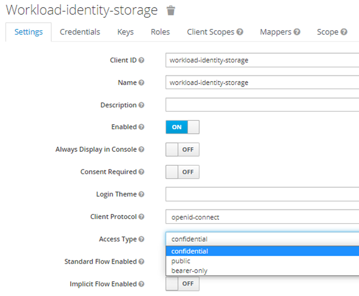

## Service Configuration for Baremetal

## Run args

In order to run Search with Java 17 additional run args must be provided:

```bash
--add-opens java.base/java.lang=ALL-UNNAMED --add-opens  java.base/java.lang.reflect=ALL-UNNAMED
```

Full command:

```bash
java -jar search.jar --add-opens java.base/java.lang=ALL-UNNAMED --add-opens java.base/java.lang.reflect=ALL-UNNAMED
```

## Table of Contents <a name="TOC"></a>

* [Environment variables](#Environment-variables)
    * [Properties set in Partition service](#properties-set-in-partition-service)
* [Elasticsearch configuration](#Elasticsearch configuration)
* [Keycloak configuration](#keycloak-configuration)
* [Running E2E Tests](#running-e2e-tests)
* [License](#license)

## Environment variables

Define the following environment variables.

Must have:

| name                                         | value         | description                                                                                                                                                                                                                                                                                               | sensitive? | source |
|----------------------------------------------|---------------|-----------------------------------------------------------------------------------------------------------------------------------------------------------------------------------------------------------------------------------------------------------------------------------------------------------|------------|--------|
| `<ELASTICSEARCH_USER_ENV_VARIABLE_NAME>`     | ex `user`     | Elasticsearch user, name of that variable not defined at the service level, the name will be received through partition service. Each tenant can have it's own ENV name value, and it must be present in ENV of Indexer service, see [Partition properties set](#properties-set-in-partition-service)     | yes        | -      |
| `<ELASTICSEARCH_PASSWORD_ENV_VARIABLE_NAME>` | ex `password` | Elasticsearch password, name of that variable not defined at the service level, the name will be received through partition service. Each tenant can have it's own ENV name value, and it must be present in ENV of Indexer service, see [Partition properties set](#properties-set-in-partition-service) | false      | -      |

Defined in default application property file but possible to override:

| name                               | value                                                           | description                                                                           | sensitive? | source                              |
|------------------------------------|-----------------------------------------------------------------|---------------------------------------------------------------------------------------|------------|-------------------------------------|
| `LOG_PREFIX`                       | `service`                                                       | Logging prefix                                                                        | no         | -                                   |
| `SERVER_SERVLET_CONTEXPATH`        | `/api/search/v2/`                                               | Servlet context path                                                                  | no         | -                                   |
| `AUTHORIZE_API`                    | ex `https://entitlements.com/entitlements/v1`                   | Entitlements API endpoint                                                             | no         | output of infrastructure deployment |
| `REDIS_SEARCH_HOST`                | ex `127.0.0.1`                                                  | Redis host for search cache                                                           | no         |                                     |
| `REDIS_SEARCH_PORT`                | ex `6379`                                                       | Redis port for search                                                                 | no         |                                     |
| `REDIS_SEARCH_PASSWORD`            | ex `*****`                                                      | Redis search host password                                                            | yes        |                                     |
| `REDIS_SEARCH_WITH_SSL`            | ex `true` or `false`                                            | Redis search host ssl config                                                          | no         |                                     |
| `REDIS_SEARCH_EXPIRATION`          | ex `30`                                                         | Redis search cache expiration in seconds                                              | no         |                                     |
| `REDIS_GROUP_HOST`                 | ex `127.0.0.1`                                                  | Redis host for search groups cache                                                    | no         |                                     |
| `REDIS_GROUP_PORT`                 | ex `6379`                                                       | Redis port for search group cache                                                     | no         |                                     |
| `REDIS_GROUP_PASSWORD`             | ex `*****`                                                      | Redis search groups host password                                                     | yes        |                                     |
| `REDIS_GROUP_WITH_SSL`             | ex `true` or `false`                                            | Redis search groups host ssl config                                                   | no         |                                     |
| `REDIS_GROUP_EXPIRATION`           | ex `30`                                                         | Redis search groups cache expiration in seconds                                       | no         |                                     |
| `SECURITY_HTTPS_CERTIFICATE_TRUST` | ex `false`                                                      | Elastic client connection uses TrustSelfSignedStrategy(), if it is 'true'             | false      | output of infrastructure deployment |
| `PARTITION_API`                    | ex `http://localhost:8080/api/partition/v1`                     | Partition service endpoint                                                            | no         | output of infrastructure deployment |
| `POLICY_API`                       | ex `http://localhost:8080/api/policy/v1/`                       | Policy service endpoint                                                               | no         | output of infrastructure deployment |
| `POLICY_ID`                        | ex `search`                                                     | policyId from ex `http://localhost:8080/api/policy/v1/policies`. Look at `POLICY_API` | no         | -                                   |
| `SERVICE_POLICY_ENABLED`           | ex `false`                                                      | Enable or Disable an integration with Policy Service                                  | no         | output of infrastructure deployment |
| `INDEXER_HOST`                     | ex `https://os-indexer-dot-opendes.appspot.com/api/indexer/v2/` | Indexer API endpoint                                                                  | no         | output of infrastructure deployment |
| `MANAGEMENT_ENDPOINTS_WEB_BASE`    | ex `/`                                                          | Web base for Actuator                                                                 | no         | -                                   |
| `MANAGEMENT_SERVER_PORT`           | ex `8081`                                                       | Port for Actuator                                                                     | no         | -                                   |

These variables define service behavior, and are used to switch between `Reference` or `Google Cloud` environments, their overriding and usage in mixed mode was not tested.
Usage of spring profiles is preferred.

| name                     | value                | description                                                                                                               | sensitive? | source |
|--------------------------|----------------------|---------------------------------------------------------------------------------------------------------------------------|------------|--------|
| `PARTITION_AUTH_ENABLED` | ex `true` or `false` | Disable or enable auth token provisioning for requests to Partition service                                               | no         | -      |

### Properties set in Partition service

Note that properties can be set in Partition as `sensitive` in that case in property `value` should be present not value itself, but ENV variable name.
This variable should be present in environment of service that need that variable.

Example:

```
    "elasticsearch.port": {
      "sensitive": false, <- value not sensitive 
      "value": "9243"  <- will be used as is.
    },
      "elasticsearch.password": {
      "sensitive": true, <- value is sensitive 
      "value": "ELASTIC_SEARCH_PASSWORD_OSDU" <- service consumer should have env variable ELASTIC_SEARCH_PASSWORD_OSDU with elastic search password
    }
```

## Elasticsearch configuration

**prefix:** `elasticsearch`

It can be overridden by:

- through the Spring Boot property `elastic-search-properties-prefix`
- environment variable `ELASTIC_SEARCH_PROPERTIES_PREFIX`

**Propertyset:**

| Property               | Description |
|------------------------|-------------|
| elasticsearch.host     | server URL  |
| elasticsearch.port     | server port |
| elasticsearch.user     | username    |
| elasticsearch.password | password    |

<details><summary>Example of a definition for a single tenant</summary></details>

```

curl -L -X PATCH 'http://partition.com/api/partition/v1/partitions/opendes' -H 'data-partition-id: opendes' -H 'Authorization: Bearer ...' -H 'Content-Type: application/json' --data-raw '{
  "properties": {
    "elasticsearch.host": {
      "sensitive": false,
      "value": "elastic.us-central1.gc.cloud.es.io"
    },
    "elasticsearch.port": {
      "sensitive": false,
      "value": "9243"
    },
    "elasticsearch.user": {
      "sensitive": true,
      "value": "<USER_ENV_VARIABLE_NAME>" <- (Not actual value, just name of env variable)
    },
      "elasticsearch.password": {
      "sensitive": true,
      "value": "<PASSWORD_ENV_VARIABLE_NAME>" <- (Not actual value, just name of env variable)
    }
  }
}'

```

## Keycloak configuration

[Keycloak service accounts setup](https://www.keycloak.org/docs/latest/server_admin/#_service_accounts)

Configure Clients. One Client per OSDU service. Set them “confidential”.



Each Client has embedded Service Account (SA) option. Enable SAs for Clients, make “Authorization enabled”:


Add `partition-and-entitlements` scope to `Default Client Scopes` and generate Keys.

Give `client-id` and `client-secret` to services, which should be authorized within the platform.


## Running E2E Tests

You will need to have the following environment variables defined.

| name                                 | value                                                           | description                                                               | sensitive?                              | source                              |
|--------------------------------------|-----------------------------------------------------------------|---------------------------------------------------------------------------|-----------------------------------------|-------------------------------------|
| `INDEXER_HOST`                       | ex `https://os-indexer-dot-opendes.appspot.com/api/indexer/v2/` | Indexer API endpoint                                                      | no                                      | output of infrastructure deployment |
| `DATA_GROUP`                         | `opendes`                                                       | The service account to this group and substitute                          | no                                      | -                                   |
| `GROUP_ID`                           | ex `opendes-gc.projects.com`                                    | OSDU R2 to run tests under                                                | no                                      | -                                   |
| `DEFAULT_DATA_PARTITION_ID_TENANT1`  | ex `opendes`                                                    | HTTP Header 'Data-Partition-ID'                                           | no                                      | -                                   |
| `DEFAULT_DATA_PARTITION_ID_TENANT2`  | ex `not-exist`                                                  | HTTP Header 'Data-Partition-ID' with not existing tenant                  | no                                      | -                                   |
| `SEARCH_HOST`                        | ex `http://localhost:8080/api/search/v2/`                       | Endpoint of search service                                                | no                                      | -                                   |
| `LEGAL_TAG`                          | ex `my-legal-tag`                                               | a valid legal tag                                                         | no                                      | -                                   |  
| `TEST_OPENID_PROVIDER_CLIENT_ID`     | `********`                                                      | Client Id for `$INTEGRATION_TESTER`                                       | yes                                     | --                                  |
| `TEST_OPENID_PROVIDER_CLIENT_SECRET` | `********`                                                      |                                                                           | Client secret for `$INTEGRATION_TESTER` | --                                  |
| `TEST_OPENID_PROVIDER_URL`           | `https://keycloak.com/auth/realms/osdu`                         | OpenID provider url                                                       | yes                                     | --                                  |

**Entitlements configuration for integration accounts**

| INTEGRATION_TESTER                                                                                                                     | NO_DATA_ACCESS_TESTER |
|----------------------------------------------------------------------------------------------------------------------------------------|-----------------------|
| users<br/>service.entitlements.user<br/>service.search.user<br/>data.test1<br/>data.integration.test<br/>users@{tenant1}@{groupId}.com |

Execute following command to build code and run all the integration tests:

```bash
# Note: this assumes that the environment variables for integration tests as outlined
#       above are already exported in your environment.
$ (cd testing/search-test-baremetal/ && mvn clean test)
```

## License

Copyright © Google LLC
Copyright © EPAM Systems

Licensed under the Apache License, Version 2.0 (the "License");
you may not use this file except in compliance with the License.
You may obtain a copy of the License at

[http://www.apache.org/licenses/LICENSE-2.0](http://www.apache.org/licenses/LICENSE-2.0)

Unless required by applicable law or agreed to in writing, software
distributed under the License is distributed on an "AS IS" BASIS,
WITHOUT WARRANTIES OR CONDITIONS OF ANY KIND, either express or implied.
See the License for the specific language governing permissions and
limitations under the License.
